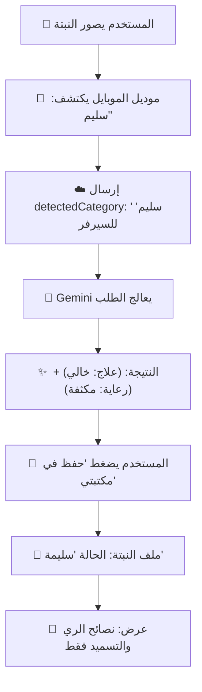
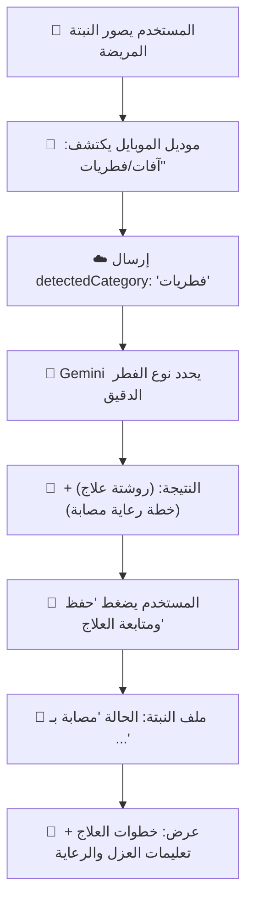

# 🔄 مسارات العمل للمستخدم والنبات (User-Plant Workflows)

يشرح هذا المستند كيف يتفاعل المستخدم مع التطبيق في الحالتين (السليمة والمريضة) وكيف ينعكس ذلك في ملف النبتة الشخصي.

---

## 🟢 السيناريو الأول: النبتة سليمة (Healthy Plant)

يحدث هذا عندما يصور المستخدم نبتته للتأكد من سلامتها أو للحصول على نصائح الرعاية.

### 📊 الرسم البياني للمسار:

### 📝 خطوات التجربة:
1.  **الفحص:** يفتح المستخدم الكاميرا، يكتشف الموديل المحلي أن النبتة ممتازة.
2.  **الرد:** السيرفر يرسل "روشتة السلامة" التي تحتوي على (أفضل مواعيد الري، نوع التسميد المناسب، وكمية الضوء).
3.  **الملف الشخصي:** تظهر النبتة في البروفايل وعليها علامة صح خضراء ✅، وبالداخل يجد المستخدم "خليل الرعاية" ليبقى النبات سليماً.

---

## 🔴 السيناريو الثاني: النبتة مريضة (Sick Plant)

يحدث هذا عند ظهور عرض غريب (بقع، ذبول، حشرات).

### 📊 الرسم البياني للمسار:

### 📝 خطوات التجربة:
1.  **الفحص:** الموديل يكتشف وجود مشكلة "آفات".
2.  **الرد:** السيرفر يحدد أن هذه "حشرة المن" مثلاً، ويرسل:
    *   **علاج:** "استخدم صابون زراعي أو مبيد سيفين".
    *   **رعاية:** "اعزل النبتة فوراً لكي لا تعدي البقية".
3.  **الملف الشخصي:** تظهر النبتة وعليها علامة تحذير ⚠️، واليوزر يتابع يومياً خطوات العلاج حتى تتحسن الحالة.

---

## 🛠️ كيف يتم التبديل بين الحالتين؟
عندما تتحسن النبتة، يقوم المستخدم بالضغط على زر **"تحديث الحالة"** (Update Status).
*   إذا قام بعمل Scan جديد وظهرت "سليمة"، يتم تحديث ملف النبتة أوتوماتيكياً لتختفي الروشتة القديمة وتتحول النبتة للمسار الأخضر.

---
**FloraAI - نرافقك في كل مراحل نمو نباتك! 🌱✨**
